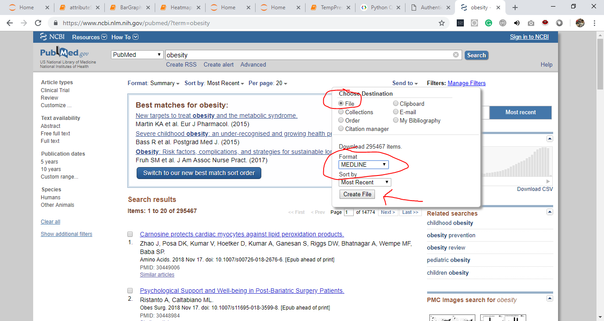
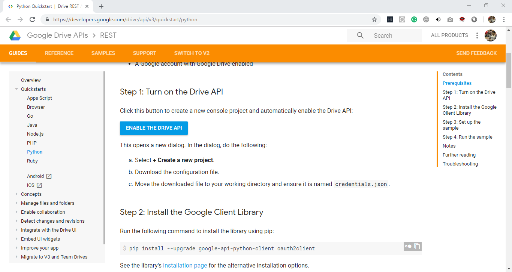
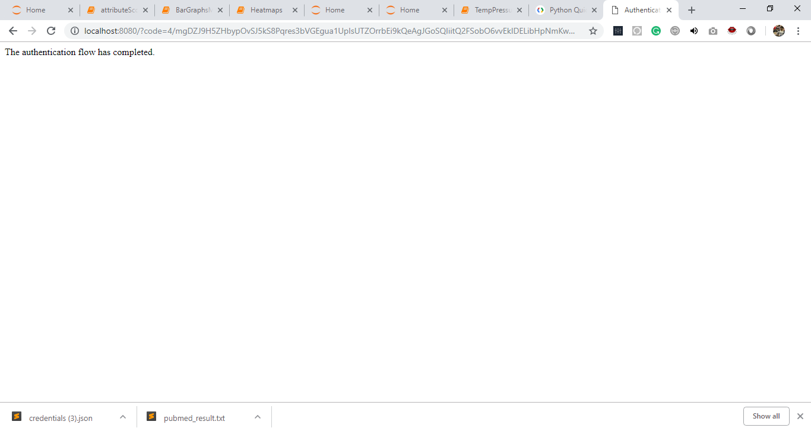
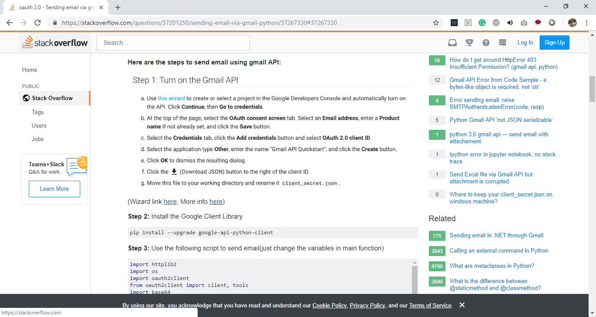
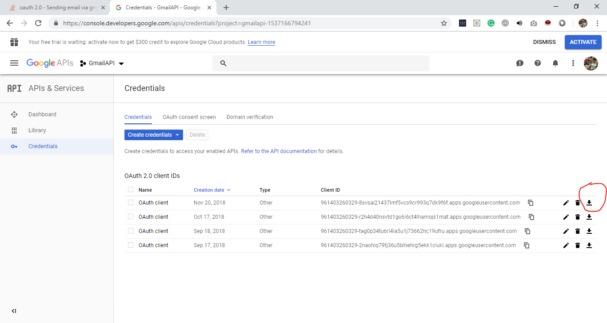
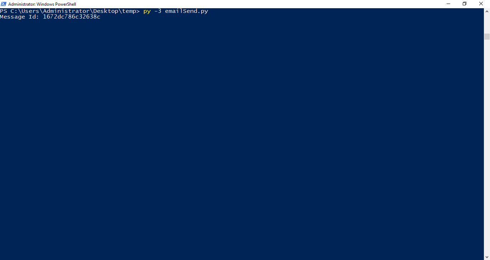
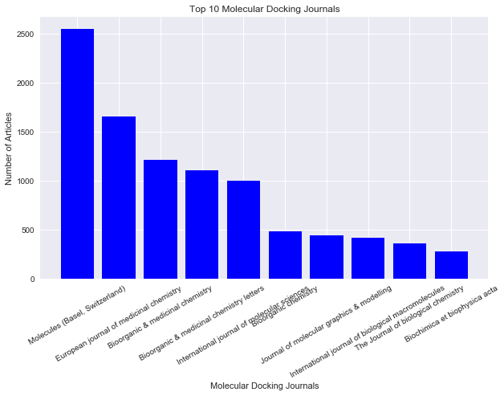
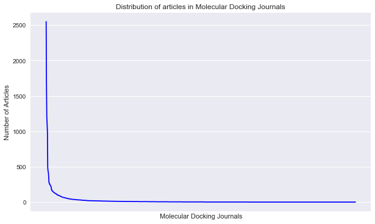
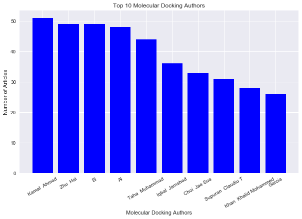
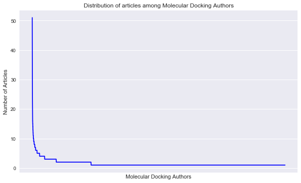

# Scientific Collaboration Network
This repository consists of all the scripts that I wrote as a class project named 'Scientific Collaboration Networks' during Networks of Life course (7th semester B.Tech) under supervision of Dr. Kamal Rawal. 

Below is the description of directories namely <b> pubmedScrap </b> (Scarping emails from pubmed), <b> sendEmail </b> (sending automating mails from python) and <b> analysis </b> (plotting degree distributing of observed data).
#### A) Scraping emails from pubmed.
#### B) Sending multiple emails using python and gmail.
#### C) Analysis of Degree Distribution of Data

# A) Scraping emails from pubmed.

### Step-1: Search required term 
Search appropriate term at <a href='https://www.ncbi.nlm.nih.gov/pubmed' target='_blank'> Pubmed </a>
### Step-2: Download pubmed_results.txt
Click on Send to, select file and select MEDLINE format followed by clicked create file button.

### Step-3: Excecute
Excecute extractFromPubmed.py script (preferabily on command prompt). 
<pre><b>
                                              python extractFromPubmed.py
</b></pre>
Note: By default it takes file named 'pubmed_result.txt' as input as writes file named 'details_v3.csv'.
'|#|' is used as default separator. The format of output is Email, Author, Title of Research Paper and Venue of publication. 

# B) Sending multiple emails using python and gmail.
Paste the file with emails (details_v3.csv) inside sendEmail directory and follow below steps required for verification of sender's email id.

### Step-1: Extract sendEmail folder
Extract attached folder on your Desktop. 

### Step-2: Enable gmail API
Open link below and follow step-1 to step-4. Download credentials.json file and paste it inside sendEmail folder. 
https://developers.google.com/drive/api/v3/quickstart/python

### Step-3: Authentication
if you can see 'The authentication flow has completed.' on the webpage then authentication with your email id was successful else follow above link for troubleshooting. 

### Step-4: client_secret.json
Follow step-1 provided as an answer by apadana on Stack Overflow. <b> Rename file as client_secret.json and paste it in sendEmail directory </b>. 
https://stackoverflow.com/a/37267330

### Step-5: Excecute 
Excecute script using any one of these (depends on python version and path variable)
<pre><b>
                                                      python sendEmail.py
                                                      Or
                                                      python3 sendEmail.py
                                                      Or
                                                      py -3 sendEmail.py
</pre></b>

If something like this is displayed then email is sent successfully else explore Stack Overflow for solution. 

# C) Analysis of degree distribution of data

Sample data is of research papers published in molecular docking disiciplines. Number of papers published in a journal and Number of papers published by an author follows scale-free degree distribution. 

### Number of molecular docking articles grouped by journals (Top - 10)

### Number of molecular docking articles grouped by journals  (All)

### Number of molecular docking articles grouped by authors (Top - 10)

### Number of molecular docking articles grouped by authors (All)

Thank-you for scrolling till here. 
